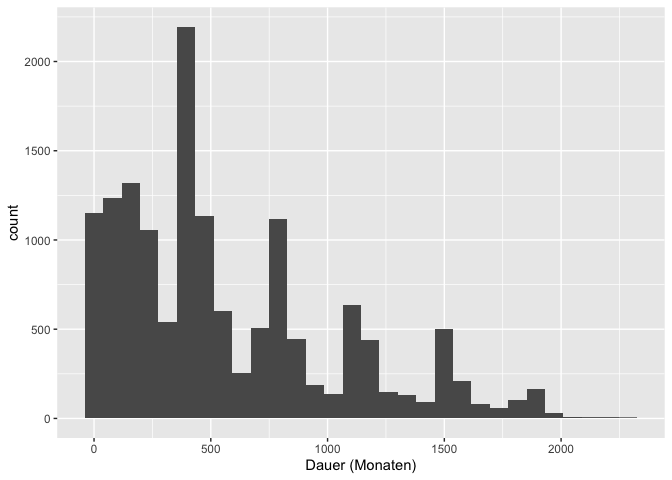

# Abodauern

Rendered from
[abodauer.qmd](https://github.com/tensorchiefs/data/tree/docs/data/abodauer.qmd)

This file can be loaded with:

``` r
df = load_data('abodauer.csv')
```

Should be rendered at
https://tensorchiefs.github.io/data/data/challenger.html

## Description

This data set contains the time (in month) a swiss newpaper has been
subscribed to by a customer.

## Plotting in R

``` r
data <- edudat::load_data("abodauer.csv")
library(ggplot2)
ggplot(data, aes(x = x)) +
  geom_histogram() + 
  xlab("Dauer (Monaten)") 
```

    `stat_bin()` using `bins = 30`. Pick better value with `binwidth`.


