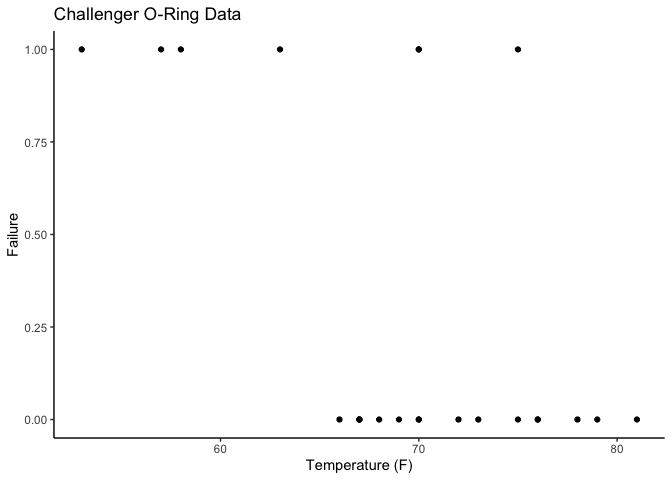

# Challenger Dataset

Rendered from
[challenger.qmd](https://github.com/tensorchiefs/data/tree/docs/data/challenger.qmd)

This file can be loaded using edudat with:

``` r
df = load_data('challenger.csv')
```

## Description

<!--  -->

This dataset contains information about the O-rings of the solid rocket
boosters used in the Space Shuttle program. The data was collected
during the investigation of the Space Shuttle Challenger disaster in
1986 (Rogers commission). Here we provide a binarized version of the
original dataset, where the dependent variable `Failure` indicates
whether at least O-ring failed (1) or not (0). This data is often used
as an example of logistic regression.

    [1] "plot"       "to_celcius"


### Further Information

A nice background story about the Challenger disaster and the fatal data
analysis done can be found
[here](https://homafiles.info/2016/06/06/the-challenger-disaster-a-tragic-lesson-in-data-analysis/).
Further infos
[wiki](https://en.wikipedia.org/wiki/Space_Shuttle_Challenger_disaster)

# For users of the “edudat” library

### Additional Functionality with {r extra,}

You can provide additional functionality, which can be used after
loading. Important, this needs a code chunk, with name “{r extra}”.

``` r
#extra
#Overwriting the plot function
plot = function(df){
  library(ggplot2)
  p = ggplot(df, aes(x = Temp, y = Failure)) +
    geom_point() + 
    xlab("Temperature (F)") +
    ggtitle("Challenger O-Ring Data")
  return(p)
}

# Custom function to translate to celcius
to_celcius = function(in_fahrenheit){
  celcius = (in_fahrenheit - 32) * 5/9
  return(celcius)
}
```

### Checking Addtional Functionality

``` r
library(ggplot2)
library(edudat)
source_extra_code(data, verbose = FALSE)
```

    character(0)

``` r
data <- load_data("challenger.csv")
plot(data) + theme_classic()
```



``` r
to_celcius(data$Temp)
```

     [1] 18.88889 21.11111 20.55556 20.00000 19.44444 22.22222 22.77778 21.11111
     [9] 13.88889 17.22222 21.11111 25.55556 19.44444 11.66667 19.44444 23.88889
    [17] 21.11111 27.22222 24.44444 26.11111 23.88889 24.44444 14.44444
