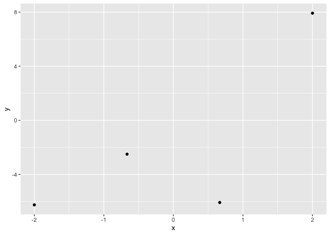

# 4 Random Data Points

Rendered from
[lr4.qmd](https://github.com/tensorchiefs/data/tree/docs/data/lr4.qmd)

This file can be loaded using edudat with:

``` r
df = load_data('lr4.csv')
```

## Description

The data set contains 4 random data points.

### Further Information

The data set is used in some example of Bayesian linear regression, in
https://www.manning.com/books/probabilistic-deep-learning.

## Plotting in R

``` r
data <- edudat::load_data("lr4.csv")
library(ggplot2)
ggplot(data, aes(x = x, y = y)) +
  geom_point() 
```



## Linear Regression

``` r
lm(y ~ x, data = data)
```


    Call:
    lm(formula = y ~ x, data = data)

    Coefficients:
    (Intercept)            x  
         -1.726        2.921  
